# 基于Springboot的博图书馆管理系统

---
### 👉作者QQ ：1556708905 微信：zheng0123Long (支持定制修改、部署调试、定制毕设)

### 👉接网站建设、小程序、H5、APP、各种系统等

---

#### 介绍

基于Springboot的图书馆管理系统是一款为图书馆设计的高效管理平台，旨在提高图书馆运营的便捷性和用户体验。该系统分为管理员角色和用户角色，分别提供了多种功能模块，以满足图书馆管理和用户借阅的需求。

#### 技术栈介绍

后端技术栈：Springboot+Mysql+Maven

前端技术栈：Vue+Html+Css+Javascript+ElementUI

开发工具：Idea+Vscode+Navicate

#### 系统功能介绍

管理员角色功能模块

个人中心：管理员可以查看和编辑个人信息，包括修改密码和更新联系方式，确保个人信息的准确性和安全性。

用户管理：管理用户信息，包括新增、修改和删除用户账号，确保用户信息的准确和及时更新。

图书分类管理：管理图书分类信息，方便图书分类的维护和查询。

图书信息管理：管理图书的详细信息，包括新增、修改和删除图书，确保图书信息的准确性和及时更新。

图书借阅管理：管理图书借阅记录，跟踪图书的借出和归还情况，确保借阅流程的有序进行。

图书归还管理：管理图书的归还记录，处理归还时的检查和确认工作。

缴纳罚金管理：处理逾期未还图书的罚金缴纳记录，确保图书馆规则的执行。

留言板管理：管理用户留言和反馈，及时处理用户的问题和建议。

系统管理：负责系统的配置和管理，包括权限设置、系统日志查看等，确保系统的安全性和稳定性。

轮插图管理：管理图书馆网站的轮播图片，提升网站的视觉效果和用户体验。

公告信息：发布和管理图书馆的公告信息，确保用户及时获取重要通知。

用户角色功能模块

图书信息：用户可以浏览和查询图书的详细信息，方便查找和借阅图书。

公告信息：查看图书馆发布的公告信息，及时获取图书馆的最新通知和动态。

留言反馈：用户可以在留言板上反馈意见和建议，与管理员进行互动交流。

个人中心：用户可以查看和编辑个人信息，包括修改密码和更新联系方式，确保个人信息的准确性和安全性。

后台管理：用户在后台可以进行多项操作，方便管理个人的借阅记录和收藏。

图书借阅管理：用户可以查看和管理自己的图书借阅记录，了解借阅情况和归还时间。

图书归还管理：用户可以处理图书的归还操作，确保按时归还借阅的图书。

缴纳罚金管理：用户可以查看和缴纳逾期未还图书的罚金记录，遵守图书馆的借阅规则。

我的收藏管理：用户可以管理个人收藏的图书，方便查找和借阅感兴趣的图书。

#### 系统作用

对管理员的作用

高效管理：系统提供了全面的管理工具，帮助管理员高效地管理用户、图书和借阅信息，确保管理工作的高效性和准确性。

信息传达：通过公告信息和留言板管理模块，管理员可以快速传达图书馆的重要信息和通知，确保信息的及时传递和沟通。

借阅规范：通过图书借阅和归还管理模块，管理员可以有效跟踪和管理图书的借还情况，维护图书馆的秩序和规范。

对用户的作用

信息获取：用户可以方便地浏览图书信息和公告信息，及时获取图书馆的最新动态和通知。

便捷操作：用户可以通过系统便捷地进行图书借阅、归还和罚金缴纳等操作，提升使用图书馆的便利性。

个人管理：个人中心和我的收藏管理模块帮助用户管理和更新个人信息，方便查找和借阅感兴趣的图书。

#### 系统功能截图

代码结构

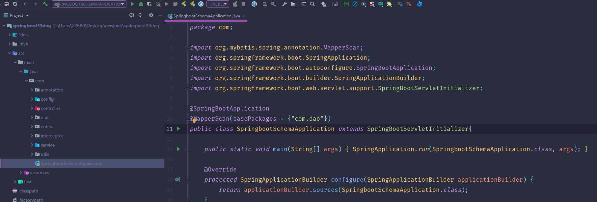

数据库表

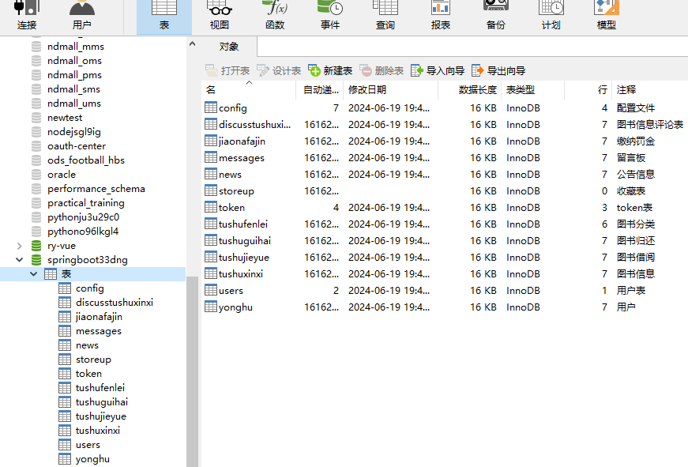

登录

图书信息管理

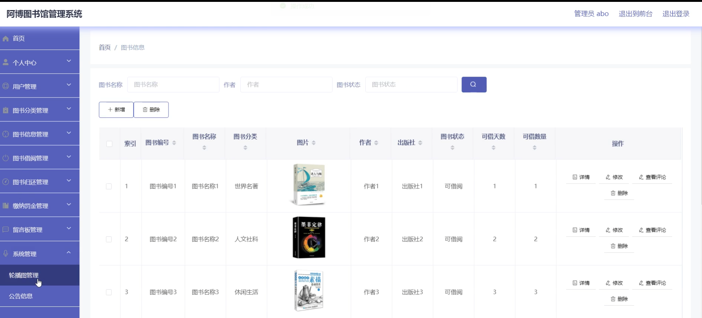

公告信息管理

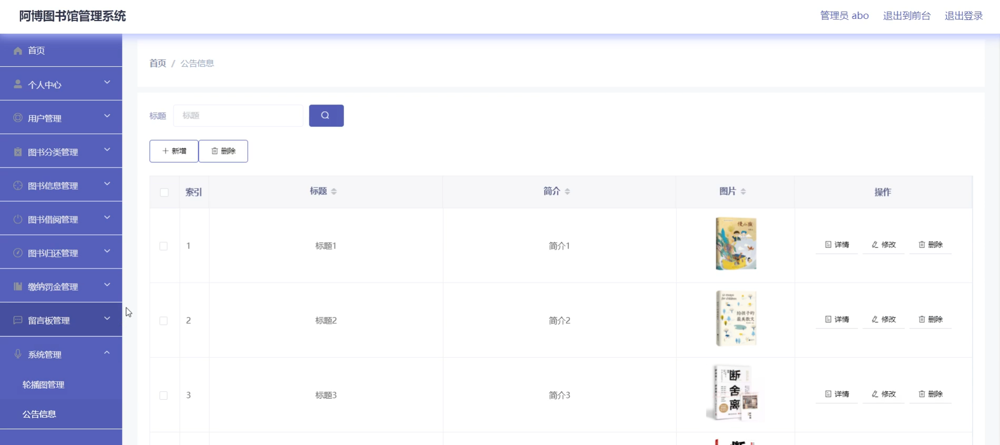

前台页面首页

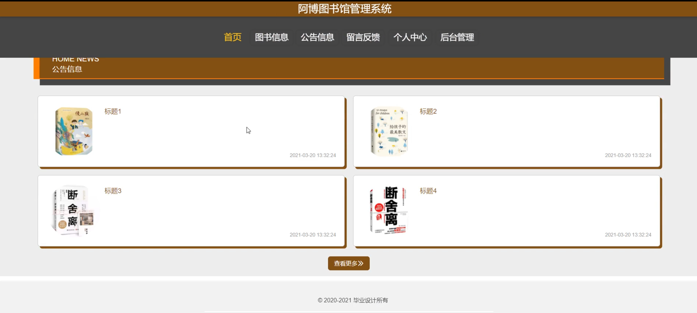

个人中心

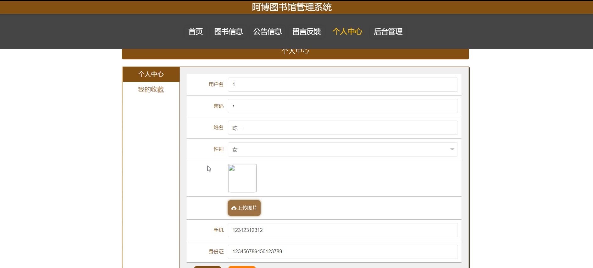

留言反馈

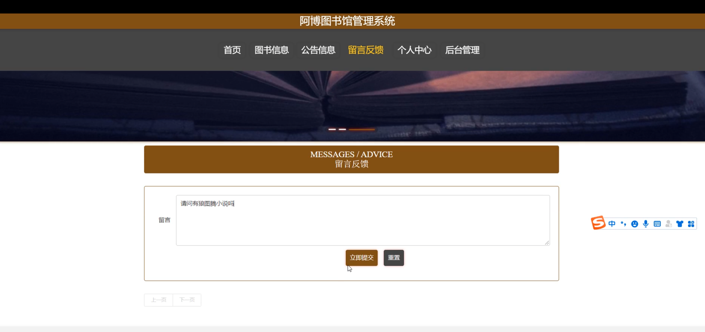

图书借阅管理

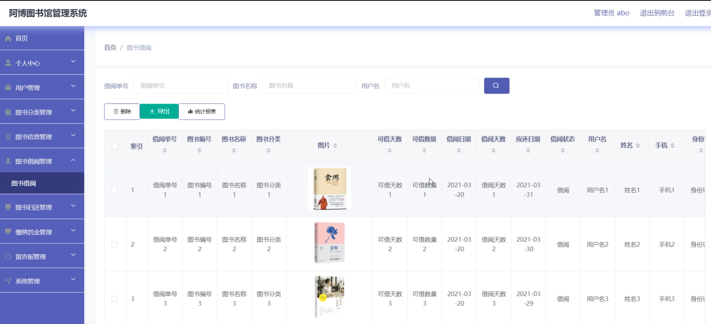

用户端后台管理

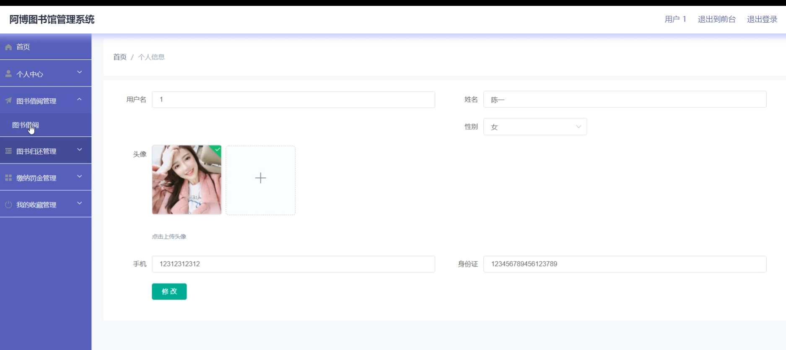

图书归还管理

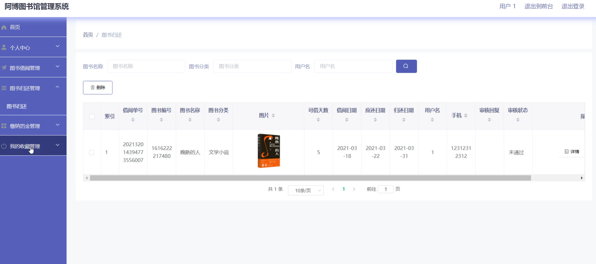

缴纳罚金管理

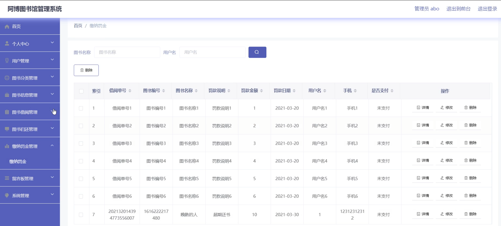

#### 总结

基于Springboot的图书馆管理系统通过角色分工和功能模块的设计，实现了图书馆的高效管理和用户的便捷使用。管理员可以通过系统全面管理用户、图书和借阅信息，确保图书馆的有序运营；用户则可以方便地获取图书信息和进行借阅操作，提升使用图书馆的体验。该系统不仅提高了图书馆管理的效率，也为用户提供了更好的服务和支持。

#### 使用说明

创建数据库，执行数据库脚本 修改jdbc数据库连接参数 下载安装maven依赖jar 启动idea中的springboot项目

后台地址：http://localhost:8080/springboot33dng/admin/dist/index.html

管理员  abo 密码 abo

前台地址：http://localhost:8080/springboot33dng/front/index.html

